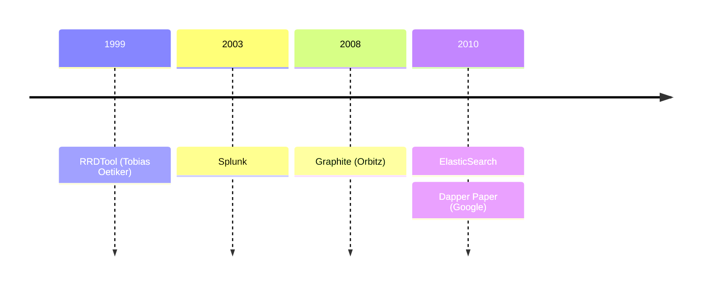
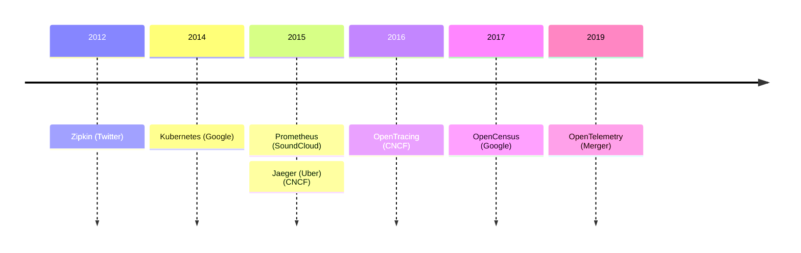
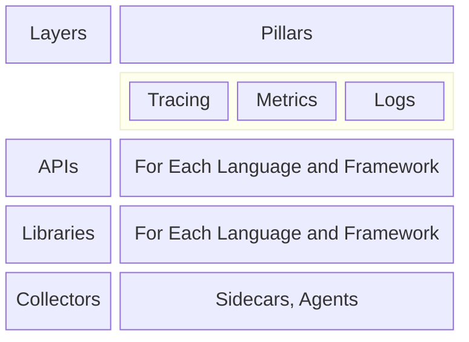

# What is Observability?

 
 

<v-clicks>

The ability to measure and understand the internal state of a system based on the data it generates.

The more _observable_ a system is, the easier it is to troubleshoot novel problems and get to the root cause.

</v-clicks>

<!--

Observability is the ability to measure and understand the internal state of a complex system (from the outside), based solely on data that it generates -- without having to rely on internal knowledge or assumptions about how the system works.

The more _observable_ a system is, the easier it is to troubleshoot novel problems (that is, the "unknown unknowns") and get to the root cause.

-->

---

# Telemetry Signals

Signals are system outputs that _describe_ the underlying activity of the system.

<v-click>

## Logs

A time-stamped text records of discrete events. { .pl-4rem }

</v-click>
<v-click>

## Traces

The path of an event through a system. { .pl-4rem }

</v-click>
<v-click>

## Metrics

Quantitative measurements at specific points in time. { .pl-4rem }

</v-click>

<!--
The data that your system needs to generate in order to be observable are called "telemetry signals", or just "signals" (or just "telemetry"). These are system outputs that _describe_ the underlying activity of the system. They can include **anything** that you want to measure or trace.

In current practice, there are three types of telemetry signals that are considered the "pillars" of observability:

- [click]Logs are time-stamped text records of discrete events. In the modern era, they are usually structured, and frequently they contain contextual information about the event or the environment in which it occurred. These are the oldest, most common, and most widely-used type of telemetry signal.
- [click]Metrics are quantitative measurements of some element of a system at a specific point in time.
- [click]Traces are about following the path of a request or event through a system. They give us the "big picture" of what happens when a request is made to an application.

-->

---

# A Brief History of Telemetry

<!--

Most of the folks talking about Telemetry and Metrics today tend to discount the tools that came _before_ "distributed tracing" like RRDTool, Splunk, Graphite, the ELK stack (Elastic/Logstash/Kibana).

In fact, I couldn't find articles discussing the history of _telemetry_ or _observability_ that went back any further than Google's Dapper paper in 2010....
-->

---

# A Brief History of Telemetry

<!--
https://blog.x.com/engineering/en_us/a/2012/distributed-systems-tracing-with-zipkin

Everyone at Google, of course, credits that paper with setting the stage for Zipkin and Jaeger, and even Prometheus.

Of course, it wasn't until after the rise of Kubernetes accelerated the adoption of microservice architectures that most of us really needed these tools -- until then, most troubleshooting and debugging was done on single application code bases, and only people working on extraordinarily large or complex systems knew they needed better tools.

Anyway. All of this is really just to give you the sort-of concept of how long OpenTelemetry has been around. OpenTracing and OpenCensus merged in 2019, and saw their 1.0 release of the new "Open Telemetry" SDKs and tools in 2012. They are not "new" any more.

That merger was a pivotal moment for observability, as the commercial and open source community rallied around the new protocols and standards, and produced SDKs for every major programming language and framework, as well as adoption in almost every commercial APM tool.

-->

---

# Telemetry Layers

<!--

Google's Census was open sourced (as OpenCensus) in 2018 with the stated goals of standardizing the way that metrics and tracing were done, improving the performance of tracing and metrics, and making them more popular. They talked at the time about distributing the cost of language and framework-specific integrations and expanding the market for application performance monitoring (APM) tools.

“Open standards and open specifications have become integral drivers of compatibility, collaboration, and convergence – the Three C’s of Open Standards” -->