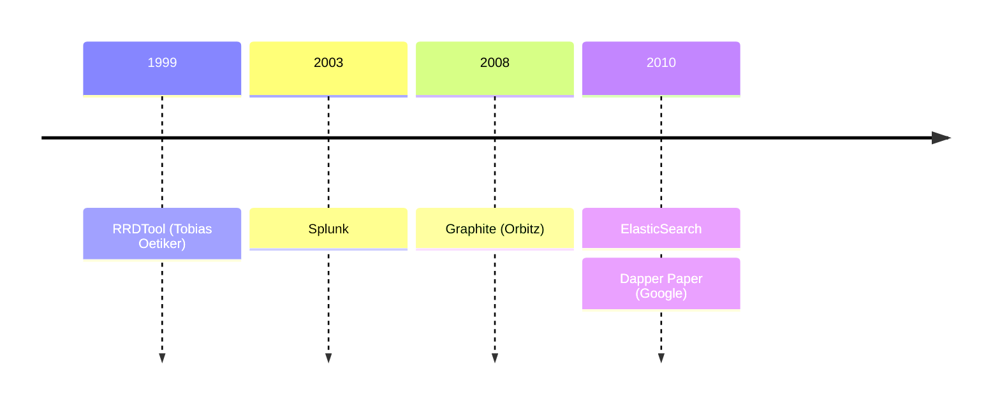
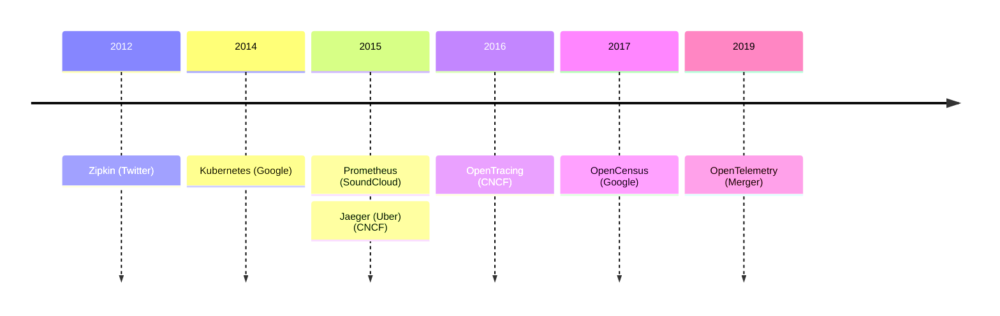

# What is Observability?

 
 

<v-clicks>

## The ability to measure and understand the internal state of a system based on the data it generates

## The more _observable_ a system is, the easier it is to troubleshoot novel problems and get to the root cause

</v-clicks>

<!--

Observability is the ability to measure and understand the internal state of a complex system (from the outside), based solely on data that it generates -- without having to rely on internal knowledge or assumptions about how the system works.

The more _observable_ a system is, the easier it is to troubleshoot novel problems (that is, the "unknown unknowns") and get to the root cause.

-->

---
layout: center
---

# What Does Observability Mean to You?

<!--

So what does this mean _to you_?

-->

---
layout: quote
author: Henrik Rexed (Dynatrace)
---

having enough information to understand a given situation

<!--

I have a few quotes here from the "Humans of Open Telemetry" interviews (as posted on tthe OpenTelemetry website).

There aren't the maintainers and contributors on the Open Telemetry project, so I think it's worth seeing what they have to say about observability.

Incidentally, I've called out where all these people work on the slides, just to emphasize a little bit that this project is not an ivory tower open source community, but rather a collaboration between all of the major players in the monitoring and observability space.

### Henrik Rexed, from Dynatrace said:

... monitoring is like, you just look at something, and observability is like having enough information to understand a given situation. So if you just look at metrics then, okay, you have a guess that something is going on, but you don’t understand. So having the options to get more information like logs, events, exceptions, traces, compiling, then at the end combine all those dimensions together, then you say, okay, I got it, this is my problem and I can resolve it.

-->

---
layout: quote
author: Amy Tobey (Equinix)
---

being able to look at things coming out of the box and tell what’s going on inside

<!--  It means being able to look at things coming out of the box and tell what’s going on inside parts. Very convenient. -->

---
layout: quote
author: Rynn Mancuso (Honeycomb)
---
actually being able to go out into the unknown and understand how complex systems are performing

<!--

For me, observability is about being able to ask deeper questions of our systems, being able to demand, I think, more than just alerting on things that are emergencies, things we’ve seen before, but actually being able to go out into the unknown and understand how complex systems are performing.

-->

---
layout: quote
author: Tyler Yahn (Splunk)
---

when you woke up at 2:00 am to go fix a problem, you can fix it.

<!--
I think Observability means that when you woke up at 2:00am to go fix a problem, you can fix it. And ideally, the next day you’re able to look at that code again and find out a way to never have that problem exist. I think that’s really what it means to me.
-->

---
layout: quote
author: Alex Boten (Honeycomb)
---

when something goes wrong, I can ask a question about my system and get a sense of what is happening without having to know ahead of time what to expect

<!-- . It means everything. Observability is life. I think Observability means that when something goes wrong, I can ask a question about my system and get a sense of what is happening without having to know ahead of time what to expect. Like I can just go and dig into my data and my services are instrumented well enough. Not like not perfectly, but well enough that I can just figure out what happened. And can I reproduce this thing that happened in probably production off in my own environment so that I can improve my code to manage it better next time. -->

---

# Telemetry Signals

Signals are system outputs that _describe_ the underlying activity of the system.

<v-click>

## Logs

A time-stamped text records of discrete events. { .pl-4rem }

</v-click>
<v-click>

## Traces

The path of an event through a system. { .pl-4rem }

</v-click>
<v-click>

## Metrics

Quantitative measurements at specific points in time. { .pl-4rem }

</v-click>

<!--
The data that your system needs to generate in order to be observable are called "telemetry signals", or just "signals" (or just "telemetry"). These are system outputs that _describe_ the underlying activity of the system. They can include **anything** that you want to measure or trace.

In current practice, there are three types of telemetry signals that are considered the "pillars" of observability:

- [click]Logs are time-stamped text records of discrete events. In the modern era, they are usually structured, and frequently they contain contextual information about the event or the environment in which it occurred. These are the oldest, most common, and most widely-used type of telemetry signal.
- [click]Metrics are quantitative measurements of some element of a system at a specific point in time.
- [click]Traces are about following the path of a request or event through a system. They give us the "big picture" of what happens when a request is made to an application.

-->

---

# A Brief History of Telemetry

<!--

Most of the folks talking about Telemetry and Metrics today tend to discount the tools that came _before_ "distributed tracing" like RRDTool, Splunk, Graphite, the ELK stack (Elastic/Logstash/Kibana).

In fact, I couldn't find articles discussing the history of _telemetry_ or _observability_ that went back any further than Google's Dapper paper in 2010....

In the early days of telemetry, all our data was in silos. We had logs, but they lived on the system where the software ran. If we had metrics, they were probably in an app-specific system, or maybe in RRDTool on each server. Traces stopped at the boundaries between services and applications.

-->

---

# A Brief History of Telemetry

<!--
https://blog.x.com/engineering/en_us/a/2012/distributed-systems-tracing-with-zipkin

Everyone at Google, of course, credits that paper with setting the stage for Zipkin and Jaeger, and even Prometheus.

Of course, it wasn't until after the rise of Kubernetes accelerated the adoption of microservice architectures that most of us really needed these tools -- until then, most troubleshooting and debugging was done on single application code bases, and only people working on extraordinarily large or complex systems knew they needed better tools.

Anyway. All of this is really just to give you the sort-of concept of how long OpenTelemetry has been around. OpenTracing and OpenCensus merged in 2019, and saw their 1.0 release of the new "Open Telemetry" SDKs and tools in 2021, but the final 1.0.0 stable version of the Open Telemetry protocol specification wasn't actually released until 2023. This isn't a brand new thing, but it's still new to many people.

That merger was a pivotal moment for observability. The commercial and open source community had been paying attentions to these efforts, and they rallied around the standardization of protocols and terminology. Today there are SDKs for every major programming language and framework, and adoption in every commercial APM tool -- even vendors you might not expect to adopt someone else's standard (like Splunk), have implemented ingestion via the protocols, and promoted the SDKs to developers.

-->

---

# Telemetry Layers

## Instrumentation is a Factorial Effort

<table>
<thead>
  <tr>
    <th></th>
    <th>Tracing</th>
    <th>Metrics</th>
    <th>Logs</th>
  </tr>
  </thead>
  <tbody>
  <tr>
    <td>APIs</td><td colspan="3">For Each Metric Type</td>
    </tr>
  <tr>
    <td>Libraries</td><td colspan="3">For Each Language and Framework</td>
    </tr>
  <tr>
    <td>Collectors</td><td colspan="3">Sidecars and Agents for each Provider</td>
    </tr>
</tbody>
</table>

<!--

And this ... is the reason why.

Without a standard, every language and framework had it's own way of implementing logging and metrics, and they all had to implement exporters and APIs for multiple vendors. Any new APM vendor that wanted to enter the market had to write their own tooling, their own SDKs, their own APIs, for each and every programming language and operating system they wanted to market to.

I interviewd for a job at DataDog years ago, when they were just planning their .NET support -- they needed to hire .NET developers who were also reverse engineers. They were looking for deep experts, people who could read IL and write low-level API intercepts, who had familiarity not just with writing .NET code, but with the source code of the framework. And they had to do that -- hiring a whole team of people with specific language and framework skills -- for _each_ language they wanted to support.

Open standards and open specifications are integral drivers of compatibility and collaboration. And yes, they make it easier for new vendors to enter the market, but they also make it possible for the big vendors to bring on-board every new language and framework, and to offload instrumentation to the framework and language authors...

Further, for many of these companies, it means they no longer have "agents" of their own that they have to maintain (we'll get into that a little more later).

Of course, on the other hand, customers were frustrated and "locked in" to the vendors they were using. Vendors each had their own SDKs, their own protocols, and data formats. In the old APM days, switching might require re-instrumenting the entire application or even making changes to infrastructure to deploy all new agents and collector/forwarders. In the microservices world, it means rebuilding and reinstrumenting dozens or hundreds of microservices, re-testing everything, because that sort of change introduces the risk of bugs and regressions.

As a result, the Open Telemetry project quickly became the second largest CNCF (Cloud Native Computing Foundation) project, second only to Kubernetes.

-->

---

# Open Standards and Specifications

[Open Telemetry Protocol (OTLP)](https://github.com/open-telemetry/opentelemetry-proto)

<v-clicks depth="2">

A gRPC protocol for encoding telemetry data and sending it from a client (the source of     telemetry data) to a server, with special attention to "agents" and "forwarders" (which are both client and server).

- Logs
- Metrics
- Traces
- Profiling (in development)

</v-clicks>

<!--
Both OpenTracing and OpenCensus were open source projects that were trying to create _standards_ and _specifications_ that would allow for interoperability. Their merger meant there was one standard, one specification. Ironically, that standard specifically calls out problems with the OpenCensus protocol (like lack of delivery guarantees).

The Open Telemetry Protocol (OTLP) uses Protocol Buffers and binary serialization for encoding telemetry data, and sends it over gRPC. It's conflicting goals are to be highly reliable and make sure failures are visible, to have high throughput, low CPU usage and minimal pressure on memory, all while supporting the ability of forwarders to efficiently modify data before forwarding it.

The OTLP protocol 1.0.0 had support for traces, metrics, and logs.

Profiles were added as "development" in 1.3.0 (last year).

-->
