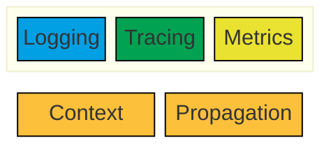
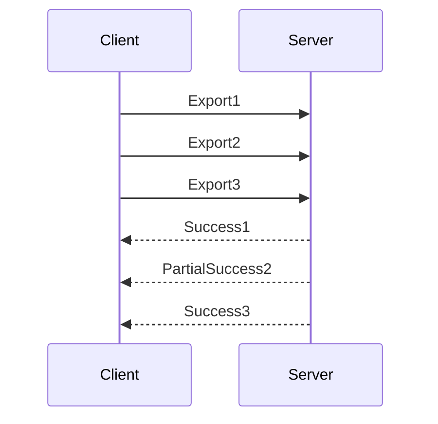

# What is Observability?

<br/>
<br/>

<v-clicks>

## The ability to measure and understand the internal state of a system based on the data it generates

## The more _observable_ a system is, the easier it is to troubleshoot novel problems and get to the root cause

</v-clicks>

<!--

Observability is the ability to measure and understand the internal state of a complex system (from the outside), based solely on data that it generates -- without having to rely on internal knowledge or assumptions about how the system works.

The more _observable_ a system is, the easier it is to troubleshoot novel problems (that is, the "unknown unknowns") and get to the root cause.

-->

---
layout: center
---

# What Does Observability Mean to You?

<!--

So what does this mean _to you_?

-->

---
layout: quote
author: Henrik Rexed (Dynatrace)
---

having enough information to understand a given situation

<!--

I have a few quotes here from the "Humans of Open Telemetry" interviews (as posted on tthe OpenTelemetry website).

There aren't the maintainers and contributors on the Open Telemetry project, so I think it's worth seeing what they have to say about observability.

Incidentally, I've called out where all these people work on the slides, just to emphasize a little bit that this project is not an ivory tower open source community, but rather a collaboration between all of the major players in the monitoring and observability space.

### Henrik Rexed, from Dynatrace said:

... monitoring is like, you just look at something, and observability is like having enough information to understand a given situation. So if you just look at metrics then, okay, you have a guess that something is going on, but you don’t understand. So having the options to get more information like logs, events, exceptions, traces, compiling, then at the end combine all those dimensions together, then you say, okay, I got it, this is my problem and I can resolve it.

-->

---
layout: quote
author: Amy Tobey (Equinix)
---

being able to look at things coming out of the box and tell what’s going on inside

<!--  It means being able to look at things coming out of the box and tell what’s going on inside parts. Very convenient. -->

---
layout: quote
author: Rynn Mancuso (Honeycomb)
---
actually being able to go out into the unknown and understand how complex systems are performing

<!--

For me, observability is about being able to ask deeper questions of our systems, being able to demand, I think, more than just alerting on things that are emergencies, things we’ve seen before, but actually being able to go out into the unknown and understand how complex systems are performing.

-->

---
layout: quote
author: Tyler Yahn (Splunk)
---

when you woke up at 2:00 am to go fix a problem, you can fix it.

<!--
I think Observability means that when you woke up at 2:00am to go fix a problem, you can fix it. And ideally, the next day you’re able to look at that code again and find out a way to never have that problem exist. I think that’s really what it means to me.
-->

---
layout: quote
author: Alex Boten (Honeycomb)
---

when something goes wrong, I can ask a question about my system and get a sense of what is happening without having to know ahead of time what to expect

<!-- . It means everything. Observability is life. I think Observability means that when something goes wrong, I can ask a question about my system and get a sense of what is happening without having to know ahead of time what to expect. Like I can just go and dig into my data and my services are instrumented well enough. Not like not perfectly, but well enough that I can just figure out what happened. And can I reproduce this thing that happened in probably production off in my own environment so that I can improve my code to manage it better next time. -->

---

# A Brief History

```mermaid {theme: 'dark', themeVariables: { 'cScale0': '#01A0E4', 'cScaleLabel0': '#000', 'cScale1': '#00A8B5', 'cScaleLabel1': '#000', 'cScale2': '#01A252', 'cScaleLabel2': '#000', cScale3: '#85C53D', cScaleLabel3: '#000', cScale4: '#EAE230', cScaleLabel4: '#000', cScale5: '#FCC03B', cScaleLabel5: '#000'}}
timeline
    1999 : RRDTool (Tobias Oetiker)
    2003 : Splunk
    2008 : Graphite (Orbitz)
         : NewRelic
    2009 : ElasticSearch
    2010 : DataDog
         : Dapper Paper (Google)
```

<!--

Most of the folks talking about Telemetry and Metrics today tend to discount the tools that came _before_ "distributed tracing" like RRDTool, Splunk, Graphite, the ELK stack (Elastic/Logstash/Kibana).

In fact, I couldn't find articles discussing the history of _telemetry_ or _observability_ that went back any further than Google's Dapper paper in 2010....

In the early days (just a couple decades ago), all our data was in silos. We had logs, but they lived on the system where the software ran. We used them for reactive troubleshooting (after something breaks, we use the logs to figure out why). When people started collecting metrics, they were usually in an app-specific system, or maybe in a system like RRDTool _on each server_. Traces stopped at the boundaries between services and applications.

-->

---

# A Brief History

```mermaid {theme: 'dark', themeVariables: { 'cScale0': '#01A0E4', 'cScaleLabel0': '#000', 'cScale1': '#00A8B5', 'cScaleLabel1': '#000', 'cScale2': '#01A252', 'cScaleLabel2': '#000', cScale3: '#85C53D', cScaleLabel3: '#000', cScale4: '#EAE230', cScaleLabel4: '#000', cScale5: '#FCC03B', cScaleLabel5: '#000'}}
timeline
    2012 : Zipkin (Twitter)
    2014 : Kubernetes (Google)
    2015 : Prometheus (SoundCloud)
         : Jaeger (Uber) (CNCF)
    2016 : OpenTracing (CNCF)
    2017 : OpenCensus (Google)
    2019 : OpenTelemetry (Merger)
```

<!--
https://blog.x.com/engineering/en_us/a/2012/distributed-systems-tracing-with-zipkin

Everyone at Google, of course, credits that paper with setting the stage for Zipkin and Jaeger, and even Prometheus.

Of course, it wasn't until after the rise of Kubernetes accelerated the adoption of microservice architectures that most of us really needed these tools -- until then, most troubleshooting and debugging was done on single application code bases, and only people working on extraordinarily large or complex systems knew they needed better tools.

Anyway. All of this is really just to give you the sort-of concept of how long OpenTelemetry has been around. OpenTracing and OpenCensus merged in 2019, and saw their 1.0 release of the new "Open Telemetry" SDKs and tools in 2021, but the final 1.0.0 stable version of the Open Telemetry protocol specification wasn't actually released until 2023. This isn't a brand new thing, but it's still new to many people.

That merger was a pivotal moment for observability. The commercial and open source community had been paying attentions to these efforts, and they rallied around the standardization of protocols and terminology. Today there are SDKs for every major programming language and framework, and adoption in every commercial APM tool -- even vendors you might not expect to adopt someone else's standard (like Splunk), have implemented ingestion via the protocols, and promoted the SDKs to developers.

-->

---
layout: two-cols
rightClass: col-span-4
leftClass: col-span-8
---

::header::
# Telemetry Signals

::left::

In general, we describe telemetry as a set of system outputs called _**signals**_, which require a mechanism for context discovery and propagation.

::right::



<!--
The data that your system needs to generate in order to be observable are called "telemetry signals", or just "signals" (or just "telemetry"). These are system outputs that _describe_ the underlying activity of the system. They can include **anything** that you want to measure or trace.

In current practice, there are three types of telemetry signals that are considered the "pillars" of observability:

- Logs are time-stamped text records of discrete events. In the modern era, they are usually structured, and frequently they contain contextual information about the event or the environment in which it occurred. These are the oldest, most common, and most widely-used type of telemetry signal.
- Metrics are quantitative measurements of some element of a system at a specific point in time.
- Traces are about following the path of a request or event through a system. They give us the "big picture" of what happens when a request is made to an application.

They are designed to work together --  so that you can correlate logs, metrics, and traces together.

-->

---
layout: two-cols
---

::header::

# Telemetry Layers

::left::

Each signal works as a cross-cutting concern, involving each part of the system.

<table>
<thead>
  <tr>
    <th></th>
    <th>Tracing</th>
    <th>Metrics</th>
    <th>Logs</th>
  </tr>
  </thead>
  <tbody>
  <tr>
    <td>Frameworks</td><td colspan="3">APIs for each Metric Type</td>
    </tr>
  <tr>
    <td>Applications</td><td colspan="3">Libraries for each Language</td>
    </tr>
  <tr>
    <td>Collectors</td><td colspan="3">Sidecars and Agents Galore</td>
    </tr>
</tbody>
</table>

::right::


<!--

Although each signal can be used independently, they are cross-cutting concerns, which require implementation throughout the stack, in each langauge and framework, in each application, in agents and servers that collect the data, and clients which may dsplay it.

Ultimately, this is the reason why we needed standards.

Without a standard, every language and framework had it's own way of implementing logging and metrics, and they all had to implement exporters and APIs for multiple vendors. Any new APM vendor that wanted to enter the market had to write their own tooling, their own SDKs, their own APIs, for each and every programming language and operating system they wanted to market to.

I interviewd for a job at DataDog years ago, when they were just planning their .NET support -- they needed to hire .NET developers who were also reverse engineers. They were looking for deep experts, people who could read IL and write low-level API intercepts, who had familiarity not just with writing .NET code, but with the source code of the framework. And they had to do that -- hiring a whole team of people with specific language and framework skills -- for _each_ language they wanted to support.

Open standards and open specifications are integral drivers of compatibility and collaboration. And yes, they make it easier for new vendors to enter the market, but they also make it possible for the big vendors to bring on-board every new language and framework, and to offload instrumentation to the framework and language authors...

Further, for many of these companies, it means they no longer have "agents" of their own that they have to maintain (we'll get into that a little more later).

Of course, on the other hand, customers were frustrated and "locked in" to the vendors they were using. Vendors each had their own SDKs, their own protocols, and data formats. In the old APM days, switching might require re-instrumenting the entire application or even making changes to infrastructure to deploy all new agents and collector/forwarders. In the microservices world, it means rebuilding and reinstrumenting dozens or hundreds of microservices, re-testing everything, because that sort of change introduces the risk of bugs and regressions.

As a result, the Open Telemetry project quickly became the second largest CNCF (Cloud Native Computing Foundation) project, second only to Kubernetes.

-->
---
layout: two-cols
---

::header::
# OpenTelemetry Architecture

::left::

Specifications, Protocols, Standards and conventions.

But also APIs, SDKs, zero-code instrumentation agents, collectors, forwarders, and more.

::right::


<!--

So in the end, OpenTelemetry is not **just** standards and specifications and semantic conventions, but also APIs and SDKs, agents, collectors and forwarders. All of the APM vendors have embraced "observability" as the new marketing buzzword, and have involved themselves to various degrees in the Open Telemetry project, to support the development of those specifications and standards, and to ensure that their products will be among the best at collecting and visualizing the data -- because ultimately, that's where the competition continues.

There are SDKs for the parts that can be set up and managed independently, exposing constants, helpers and interfaces for applications to use for instrumentation.

-->

---

# Open Standards and Specifications

[Open Telemetry Protocol (OTLP)](https://github.com/open-telemetry/opentelemetry-proto)

A gRPC protocol for encoding telemetry data and sending it from a client (any source of telemetry data) to a server, with special attention to "agents" and "forwarders" (which are both client and server).

- Logs
- Metrics
- Traces
- Profiling (in development)

<!--

So let's talk about those standards and specs for a minute.

OpenTracing and OpenCensus were both open source projects trying to create _standards_ and _specifications_ for interoperability. Their merger basically sealed the deal, and convinced everyone that we could agree on a single standard... The new standard specifically calls out problems with the old ones (like lack of delivery guarantees in OpenCensus), and took some time to iron out:

It's (conflicting) goals are: to be highly reliable and make sure failures are visible, to have high throughput, low CPU usage and minimal pressure on memory, all while supporting the ability of forwarders to efficiently modify data before forwarding it.

The OTLP protocol 1.0.0 had support for traces, metrics, and logs.

Profiles were added as "development" in 1.3.0 (last year).

So what is in that protocol?

-->
---
layout: two-cols
rightClass: col-span-4
leftClass: col-span-8
---

::header::

# What is in the Protocol?

::left::

## How [deep](https://opentelemetry.io/docs/specs/otlp/) shall we go?

<v-clicks>

[HTTTP/2](https://http2.github.io/) changed the "on the wire" representation of HTTP for performance: a _binary encoding_ of HTTP supports multiplexing over a single connection, making it faster and more efficient.

[gRPC](https://grpc.io/) is a general Remote Procedure Call framework built on HTTP/2 and Protocol Buffers. It features bi-directional streaming, load-balancing, service mesh, authentication...

[OTLP](https://opentelemetry.io/docs/specs/otlp/) is _therefore_ a high-throughput binary request/response [protocol](https://github.com/open-telemetry/opentelemetry-proto/tree/v1.5.0/opentelemetry/proto), supporting interleaved, concurrent requests and responses.

</v-clicks>

::right::

<v-after>



</v-after>

<!--

OTLP is built on gRPC, which is built on HTTP/2 which is ... where I'm going to draw the line. Everyone's heard of HTTP, but do you know what's _different_ about HTTP/2?

[click] For our purposes today, all you really need to know about HTTP/2 is that it's a _binary_ encoding of the HTTP protocol, focused on performance. The binary encoding enabled new approaches to data delivery, including multiplexing or interleaving _simultaneous streams_ of information over a single connection. This way, even with a single connection we don't have to wait for one request to finish before sending another.

[click]The gRPC framework is an open-source general Remote Procedure Call framework built on HTTP/2 and Protocol Buffers.

in 2013 Google decided to open source a protocol which they had been using internally, and after three years of re-writing, they initially released gRPC 1.0.0 in 2016, and donated it to the CNCF in 2017.

From the begining it's been about bi-directional streaming with retries and timeouts over HTTP/2 (actually, SPDY when they first started), and gRPC now includes features such as client-side load-balancing, proxyless service mesh, tracing, authentication and authorization, interceptors, and more across 11 programming languages. It is a highly efficient, widely used framework for microservices and other distributed systems.

Incidentally, when I say Open Source: this framework is actually licensed under Apache 2.0, BSD, and MPL (Mozilla Public License).

[click]OTLP obviously benefits from everything it's based on. It's a request/response protocol that supports interleaved, concurrent requests for high throughput. Each request gets a response indicating success or failure, or even partial success (if, for example, some of the data was rejected as duplicate). This allows for high throughput _and_ low latency in the delivery of telemetry data. The protocol specifies when exports can be retried, and servers can signal backpressure (they return "unavailable") and signal retry delays. **All** of this basically comes from gRPC and HTTP/2.

Now, we can get deeper into the details of the payloads, but if you want to do that, I'm literally going to dive into the protocol specification on GitHub... otherwise, we can move on to some demos of running systems and code.

-->

---

# Semantic Conventions

A [common set](https://opentelemetry.io/docs/specs/semconv/) of attributes which provide meaning to data

### **Attribute**: a standardized name and data type

### **Metric**: a standardized name, type, and unit of measure

For [Resources](https://opentelemetry.io/docs/specs/semconv/resource/), [Events](https://opentelemetry.io/docs/specs/semconv/general/events/), [Metrics](https://opentelemetry.io/docs/specs/semconv/general/metrics/), [Logs](https://opentelemetry.io/docs/specs/semconv/general/logs/), [Trace Spans](https://opentelemetry.io/docs/specs/semconv/general/trace/), performance [Profiles](https://opentelemetry.io/docs/specs/semconv/general/profiles/), etc.

<!--

The Open Telemetry project starts with the OTLP protocol, the API specifications (and implementations in SDKs), but it also includes _Semantic Conventions_.

Semantic Conventions are a common set of (semantic) attributes which provide meaning to the data in our signals. Think of them as the standard dimensions of common signals, they follow a naming scheme that can be standardized across your codebase and has been followed in all of the libraries and platforms and SDKs from OpenTelemetry. This is key to correlation and consumption of data.

An Attribute is a standardized name and data type, which can be used to annotate signals.

A Metric is a standardized measurement name, type, and unit of measure, plus a set of attributes that are required or recommended to describe the metric.

There are defined conventions for Resources (like "Service" and "Environment" and "Compute Unit" and "Version"), and Events, as well as for Metrics, Log Attributes, Trace Span Attributes, and even Profiling data. In general, the goal is to standardize on a common set of attributes and dimensions for each type of signal, so that you can understand the data even if you've never seen the system before.
-->

---

# A few examples

- [Http Metrics](https://opentelemetry.io/docs/specs/semconv/http/http-metrics/#metric-httpserverrequestduration)
- [CICD & VCS Metrics](https://opentelemetry.io/docs/specs/semconv/cicd/cicd-metrics/)
- [GenAI Metrics](https://opentelemetry.io/docs/specs/semconv/gen-ai/gen-ai-metrics/)
- [GraphQL Spans](https://opentelemetry.io/docs/specs/semconv/graphql/graphql-spans/)
- [Code Attributes](https://opentelemetry.io/docs/specs/semconv/code/)
- [Azure Events](https://opentelemetry.io/docs/specs/semconv/azure/events/)
- [Messaging Spans](https://opentelemetry.io/docs/specs/semconv/messaging/messaging-spans/)

<!--

Take for instance the HTTP server metrics. The `http.server.request.duration` metric is a histogram measured in seconds. It's defined by convention as having several _required_ attributes: http.request.method, url.scheme, the http.route (if known), and the network.protocol.name, plus a few aditional attributes when there's an error (like the error.type and the http.response.status_code), some recommended properties (like the protocol version), and some additional "opt-in" attributes: the server address and port, and the user type.

There are just a few other http metrics defined:

- http.server.request.duration (_histogram_, seconds) (already talked about)
- http.server.active_requests (_counter_, count)
- http.server.request.body.size (_histogram_, bytes)
- http.server.response.body.size (_histogram_, bytes)

But there are so many more metrics here that you might be interested in. How about CICD or Version Control Metrics? Or Code attributes for annotating logs? Did you know there's a growing set of standard metrics for measuring the performance of Generative AI client systems?

- cicd.pipeline.run duration (_histogram_, seconds)
- cicd.pipeline.run.active (_counter_, runs)
- cicd.worker.count (_counter_, workers)
- cicd.pipeline.run.errors (_counter_, errors)
- cicd.system.errors (_counter_, errors)

-->

---
layout: image-right
image: /images/otel-demo-architecture.png
equal: true
---
# Let's see it

There is an [OpenTelemetry Demo](https://opentelemetry.io/ecosystem/demo/) on [GitHub](https://github.com/open-telemetry/opentelemetry-demo) with great [docs](https://opentelemetry.io/docs/demo/), which you can run locally to see how OpenTelemetry works in practice.

Right now, I'm running it on [otel.poshcode.com](https://otel.poshcode.com) and you can even access [grafana](https://otel.poshcode.com/grafana) and [Jaeger](https://otel.poshcode.com/jaeger/ui) to see the data. Please don't mess with the feature flags while I'm running the demo 🥹

<!--

The leaky recommender

C:\Users\joelbennett\Projects\opentelemetry-demo\src\recommendation\recommendation_server.py:78

https://gitkraken.dev/link/dnNjb2RlOi8vZWFtb2Rpby5naXRsZW5zL2xpbmsvci83NWJmODRmYTc3M2NmNzA2NmVjNDBjY2JlNDAwZjVkNzM0YTJiNGI5L2Yvc3JjL3JlY29tbWVuZGF0aW9uL3JlY29tbWVuZGF0aW9uX3NlcnZlci5weT91cmw9Z2l0JTQwZ2l0aHViLmNvbSUzQW9wZW4tdGVsZW1ldHJ5JTJGb3BlbnRlbGVtZXRyeS1kZW1vLmdpdCZsaW5lcz03OA%3D%3D?origin=gitlens


The missing telescope.

C:\Users\joelbennett\Projects\opentelemetry-demo\src\product-catalog\main.go:337

https://gitkraken.dev/link/dnNjb2RlOi8vZWFtb2Rpby5naXRsZW5zL2xpbmsvci83NWJmODRmYTc3M2NmNzA2NmVjNDBjY2JlNDAwZjVkNzM0YTJiNGI5L2Yvc3JjL3Byb2R1Y3QtY2F0YWxvZy9tYWluLmdvP3VybD1naXQlNDBnaXRodWIuY29tJTNBb3Blbi10ZWxlbWV0cnklMkZvcGVudGVsZW1ldHJ5LWRlbW8uZ2l0JmxpbmVzPTMzNw%3D%3D?origin=gitlens

-->